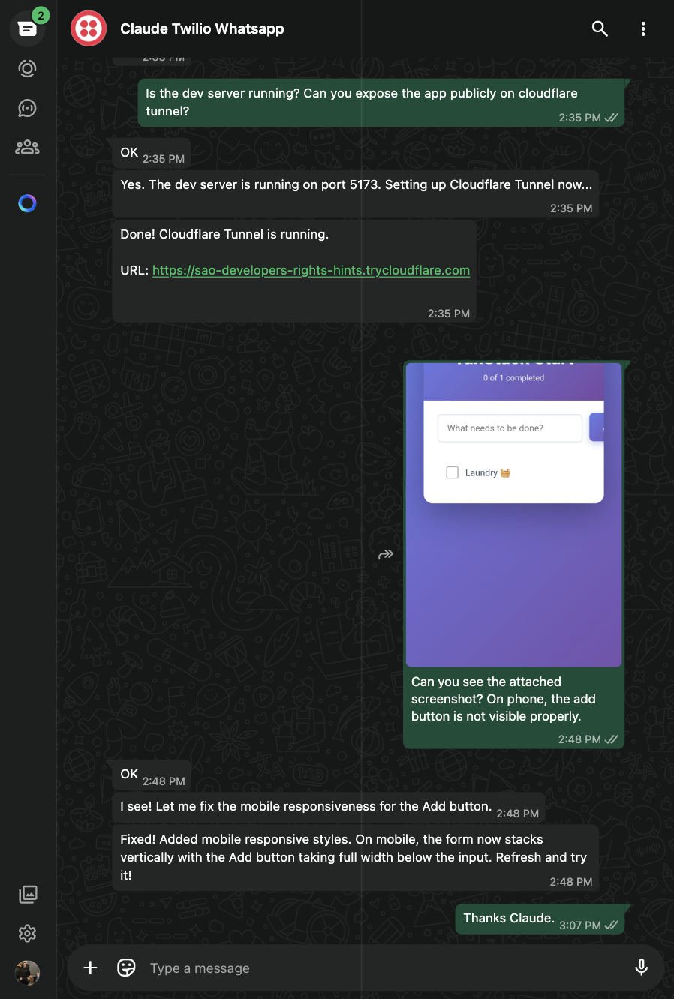

# Better Call Claude

<p align="center">
  
</p>

<p align="center">
  <strong>Bi-directional communication for Claude Code via Voice Calls, SMS, and WhatsApp.</strong><br>
  Call Claude from your phone to start tasks, and receive callbacks when Claude needs input or wants to share status.
</p>

> 📞 "Hey Claude, refactor the auth module and call me when you're done or need a decision."
>
> *[20 minutes later, phone rings]*
>
> 🤖 "I've finished the refactor but found a security issue. Should I fix it now or create a ticket?"

> 💬 *Or via SMS/WhatsApp:*
>
> You: "Claude, how's the deployment going?"
>
> Claude: "Deployment complete. 3 services updated, all health checks passing."

## Features

- **📱 Inbound calls** - Call Claude Code from your phone to start tasks
- **📲 Outbound calls** - Claude calls you when done, stuck, or needs decisions
- **💬 SMS messaging** - Send and receive text messages with Claude
- **📱 WhatsApp** - Full WhatsApp Business integration
- **🔄 Cross-channel context** - Start on voice, continue on WhatsApp seamlessly
- **🔗 Persistent sessions** - Claude stays alive listening for WhatsApp messages
- **🔒 Secure transport** - Tailscale Funnel with guided auto-setup
- **🗣️ Natural conversations** - Multi-turn interactions across all channels
- **🔧 Tool composable** - Claude can use other tools while communicating
- **⚡ Auto-webhook updates** - Twilio webhooks auto-update when URL changes
- **⌚ Works anywhere** - Phone, smartwatch, or any device

> ### ⚠️ Testing Status
>
> | Channel | Provider | Status |
> |---------|----------|--------|
> | Voice | Twilio | ✅ **Tested & Working** |
> | WhatsApp | Twilio Sandbox | ✅ **Tested & Working** |
> | SMS | Twilio | ⏳ Pending A2P 10DLC verification |
> | Voice | Telnyx | 🔬 Not yet tested |
> | SMS | Telnyx | 🔬 Not yet tested |
> | WhatsApp | Telnyx | 🔬 Not yet tested |
>
> *Contributions welcome for testing other provider/channel combinations!*

---

## Quick Start

### 1. Get Required Accounts

| Service | Purpose | Cost |
|---------|---------|------|
| [Telnyx](https://telnyx.com) or [Twilio](https://twilio.com) | Phone calls | ~$1/mo + usage |
| [OpenAI](https://platform.openai.com) | Speech-to-text & text-to-speech | ~$0.03/min |
| [Tailscale](https://tailscale.com) | Webhook tunneling | Free |

### 2. Set Up Phone Provider

<details>
<summary><b>Option A: Telnyx (Recommended - 50% cheaper)</b></summary>

1. Create account at [portal.telnyx.com](https://portal.telnyx.com) and verify identity
2. [Buy a phone number](https://portal.telnyx.com/#/numbers/buy-numbers) (~$1/month)
3. [Create a Voice API application](https://portal.telnyx.com/#/call-control/applications):
   - Set webhook URL to your tunnel URL + `/webhook/telnyx/inbound`
   - Set API version to v2
4. **Enable SMS** on your phone number:
   - Go to [Messaging](https://portal.telnyx.com/#/messaging) and create a Messaging Profile
   - Assign your phone number to the profile
   - Set SMS webhook URL to your tunnel URL + `/webhook/telnyx/sms`
5. **Enable WhatsApp** (optional):
   - Go to [WhatsApp](https://portal.telnyx.com/#/whatsapp) in portal
   - Complete WhatsApp Business verification
   - Set webhook URL to your tunnel URL + `/webhook/telnyx/whatsapp`
6. [Verify your phone number](https://portal.telnyx.com/#/numbers/verified-numbers) for outbound calls
7. Get your **Connection ID** (or Messaging Profile ID) and **API Key**

</details>

<details>
<summary><b>Option B: Twilio</b></summary>

1. Create account at [twilio.com/console](https://www.twilio.com/console)
2. [Buy a phone number](https://www.twilio.com/console/phone-numbers/incoming)
3. Configure webhooks for your number:
   - Voice webhook: your tunnel URL + `/webhook/twilio/inbound`
   - SMS webhook: your tunnel URL + `/webhook/twilio/sms`
4. **Enable WhatsApp** (optional):
   - Go to [WhatsApp Senders](https://www.twilio.com/console/sms/whatsapp/senders)
   - Complete WhatsApp Business setup
   - Set webhook URL to your tunnel URL + `/webhook/twilio/whatsapp`
5. Get your **Account SID** and **Auth Token**

</details>

### 3. Set Up Tailscale Funnel (for webhooks)

Tailscale Funnel provides free, stable public URLs for receiving webhooks from your phone provider.

> **Why Tailscale?** Free unlimited tunnels, stable URLs (no random subdomains), enterprise-grade security.
>
> **Path:** Better Call Claude uses `/bcc` path (e.g., `https://your-hostname.ts.net/bcc`) to avoid conflicts with other services.

**First-time setup (automated):**

When you first start the MCP server, it will guide you through setup:

1. **Install Tailscale** (if not installed):
   ```bash
   # macOS
   brew install tailscale

   # Linux
   curl -fsSL https://tailscale.com/install.sh | sh
   ```

2. **Authenticate** - The server will auto-run `tailscale up` and open your browser

3. **Enable Funnel** - Visit the URL shown in the terminal to enable Funnel on your tailnet (one-time admin step)

That's it! The server handles the rest automatically.

### 4. Install Better Call Claude

```bash
# Quick start with bunx (recommended)
bunx better-call-claude

# Or install globally
bun install -g better-call-claude
better-call-claude
```

### 5. Add to Claude Code

Add to `~/.claude/settings.json`:

```json
{
  "mcpServers": {
    "better-call-claude": {
      "command": "bunx",
      "args": ["better-call-claude"],
      "env": {
        "BETTERCALLCLAUDE_PHONE_PROVIDER": "telnyx",
        "BETTERCALLCLAUDE_PHONE_ACCOUNT_SID": "your-connection-id",
        "BETTERCALLCLAUDE_PHONE_AUTH_TOKEN": "your-api-key",
        "BETTERCALLCLAUDE_PHONE_NUMBER": "+15551234567",
        "BETTERCALLCLAUDE_USER_PHONE_NUMBER": "+15559876543",
        "BETTERCALLCLAUDE_OPENAI_API_KEY": "sk-..."
      }
    }
  }
}
```

> **Note:** Tailscale setup is automatic on first run. The server will guide you through installation and authentication if needed.

Restart Claude Code. Done!

---

## Environment Variables

### Required Variables

| Variable | Description |
|----------|-------------|
| `BETTERCALLCLAUDE_PHONE_PROVIDER` | `telnyx` or `twilio` |
| `BETTERCALLCLAUDE_PHONE_ACCOUNT_SID` | Provider account/connection ID |
| `BETTERCALLCLAUDE_PHONE_AUTH_TOKEN` | Provider API key/auth token |
| `BETTERCALLCLAUDE_PHONE_NUMBER` | Your Telnyx/Twilio phone number (E.164) |
| `BETTERCALLCLAUDE_WHATSAPP_NUMBER` | WhatsApp number if different (e.g., Twilio Sandbox) |
| `BETTERCALLCLAUDE_USER_PHONE_NUMBER` | Your personal phone number |
| `BETTERCALLCLAUDE_OPENAI_API_KEY` | OpenAI API key for TTS/STT |

### Tailscale (Optional)

| Variable | Default | Description |
|----------|---------|-------------|
| `TAILSCALE_HOSTNAME` | auto-detected | Override Tailscale hostname |

### Optional Variables

| Variable | Default | Description |
|----------|---------|-------------|
| `BETTERCALLCLAUDE_TTS_VOICE` | `onyx` | OpenAI voice (alloy, echo, fable, onyx, nova, shimmer) |
| `BETTERCALLCLAUDE_PORT` | `3333` | Local HTTP server port |
| `BETTERCALLCLAUDE_TRANSCRIPT_TIMEOUT_MS` | `180000` | Speech timeout (3 min) |
| `BETTERCALLCLAUDE_STT_SILENCE_DURATION_MS` | `800` | End-of-speech detection |

---

## Usage

### Voice Calls

<p align="center">
  
</p>

#### You → Claude (Inbound Calls)

Call your Telnyx/Twilio phone number from your personal phone:

> 📱 "Hey Claude, I need you to write unit tests for the payment module. Call me when you're done."

Claude will acknowledge and start working. When done, it calls you back.

#### Claude → You (Outbound Calls)

Claude can initiate calls when it needs your input:

> 🤖 "I found 3 different approaches for the caching layer. Want me to explain them so you can choose?"

#### Voice Commands During Calls

- **"Hang up"** or **"Goodbye"** - End the call
- **"Hold on"** - Claude waits for you to continue
- **"Go ahead"** - Claude continues with the task
- **"Cancel that"** - Abort current action

---

### SMS Messaging

#### You → Claude (Inbound SMS)

Text your Telnyx/Twilio number:

> 💬 "Hey Claude, what's the status of the deployment?"

Claude will respond via SMS:

> 🤖 "Deployment is 80% complete. Running integration tests now. ETA: 5 minutes."

#### Claude → You (Outbound SMS)

Claude can send you text updates:

> 🤖 "Build failed on line 42 of auth.ts. Reply with 'fix' to auto-fix or 'skip' to continue."

---

### WhatsApp

#### You → Claude (Inbound WhatsApp)

Send a WhatsApp message to your business number:

> 💬 "Show me the error logs from the last hour"

Claude responds in WhatsApp:

> 🤖 "Found 3 errors:\n1. Connection timeout at 14:32\n2. Auth failure at 14:45\n3. Rate limit at 15:01\n\nWant me to investigate any of these?"

#### Claude → You (Outbound WhatsApp)

Claude can send rich WhatsApp messages:

> 🤖 "Code review complete! Found 2 issues:\n• Line 23: Unused variable\n• Line 67: Missing error handling\n\nReply 'fix' to auto-fix or 'details' for more info."

---

### Cross-Channel Context

Start a task on voice and seamlessly continue on WhatsApp - Claude remembers everything.

<p align="center">
  
</p>

#### Example Flow

1. **Call Claude:**
   > 📞 "Hey Claude, run the todo app in dev mode and let's continue on WhatsApp"

2. **Claude starts the app and enters WhatsApp listening mode:**
   > 🤖 "Todo app running on port 5173. Send me WhatsApp messages for more instructions."

3. **Send WhatsApp message:**
   > 💬 "Expose it via localtunnel and add the URL to allowed hosts"

4. **Claude responds via WhatsApp:**
   > 🤖 "Done! Localtunnel URL: https://xyz.loca.lt - I've added it to vite.config.ts allowedHosts"

5. **Continue the conversation:**
   > 💬 "What's the public IP so I can access it remotely?"
   >
   > 🤖 "Your public IP is 203.0.113.42. Access the app at https://xyz.loca.lt"

**Key phrases to trigger WhatsApp listening:**
- "Continue on WhatsApp"
- "Let's talk on WhatsApp"
- "Listen for my WhatsApp messages"

---

### WhatsApp Sandbox (Twilio)

For testing, you can use Twilio's WhatsApp Sandbox instead of a full WhatsApp Business account.

1. Go to [Twilio Console > Messaging > WhatsApp Sandbox](https://console.twilio.com/us1/develop/sms/try-it-out/whatsapp-learn)
2. Send the join code to the sandbox number (+1 415 523 8886)
3. Set the webhook URL to `{your-tailscale-url}/bcc/webhook/twilio/whatsapp`
4. Add to your config:
   ```json
   "BETTERCALLCLAUDE_WHATSAPP_NUMBER": "+14155238886"
   ```

> **Note:** Sandbox requires re-joining every 72 hours.

---

## How It Works

```
┌─────────────────┐         ┌──────────────────────────────────┐
│   Your Phone    │────────>│      Phone Provider              │
│  📞 Voice       │<────────│   (Telnyx/Twilio)                │
│  💬 SMS         │         │                                  │
│  📱 WhatsApp    │         │   • Voice API                    │
└─────────────────┘         │   • Messaging API                │
                            │   • WhatsApp Business API        │
                            └──────────────┬───────────────────┘
                                           │ webhooks
                                           ▼
                            ┌──────────────────────────────────┐
                            │     Transport Layer              │
                            │     (Tailscale Funnel)           │
                            └──────────────┬───────────────────┘
                                           │
                                           ▼
┌─────────────────┐         ┌──────────────────────────────────┐
│   Claude Code   │◄──────► │   Better Call Claude MCP Server  │
│   (your IDE)    │  stdio  │   (local, port 3333)             │
└─────────────────┘         │                                  │
                            │   • Voice handling               │
                            │   • SMS handling                 │
                            │   • WhatsApp handling            │
                            │   • Conversation management      │
                            └──────────────┬───────────────────┘
                                           │
                                           ▼
                            ┌──────────────────────────────────┐
                            │         OpenAI API               │
                            │    (Whisper STT + TTS)           │
                            │    (Voice calls only)            │
                            └──────────────────────────────────┘
```

### Communication Flows

**Voice:**
1. **Inbound:** You call → Provider → Webhook → MCP Server → Claude Code
2. **Outbound:** Claude Code → MCP Server → Provider → Your phone rings
3. **Speech:** Your voice → Whisper STT → Text → Claude → TTS → Audio playback

**SMS:**
1. **Inbound:** You text → Provider → Webhook → MCP Server → Claude Code
2. **Outbound:** Claude Code → MCP Server → Provider API → SMS delivered

**WhatsApp:**
1. **Inbound:** You message → Provider → Webhook → MCP Server → Claude Code
2. **Outbound:** Claude Code → MCP Server → Provider API → WhatsApp delivered

---

## MCP Tools

### Voice Tools

#### `receive_inbound_call`
Accept and process an incoming call from the user.

#### `initiate_call`
Start a phone call to the user.

```typescript
const { callId, response } = await initiate_call({
  message: "Hey! I finished the refactor. What should I work on next?"
});
```

#### `continue_call`
Continue an active call with follow-up messages.

```typescript
const response = await continue_call({
  call_id: callId,
  message: "Got it. Should I also add the caching layer?"
});
```

#### `speak_to_user`
Speak without waiting for a response (for acknowledgments).

```typescript
await speak_to_user({
  call_id: callId,
  message: "Let me search for that. One moment..."
});
```

#### `end_call`
End an active call.

```typescript
await end_call({
  call_id: callId,
  message: "Perfect, I'll get started. Talk soon!"
});
```

#### `get_call_status`
Check status of current or recent calls.

```typescript
const status = await get_call_status({ call_id: callId });
// { state: "active", duration: 45, transcript: [...] }
```

---

### Messaging Tools

#### `receive_inbound_message`
Check for incoming SMS or WhatsApp messages.

```typescript
const result = await receive_inbound_message({
  channel: "any",      // "sms", "whatsapp", or "any"
  timeout_ms: 5000     // How long to wait
});
// { success: true, channel: "sms", conversation_id: "...", message: "Deploy now" }
```

#### `send_sms`
Send an SMS message to the user.

```typescript
const result = await send_sms({
  message: "Build complete! 42 tests passed.",
  wait_for_reply: true,
  timeout_ms: 180000
});
// { success: true, conversation_id: "...", reply: "Great, deploy it" }
```

#### `send_whatsapp`
Send a WhatsApp message to the user.

```typescript
const result = await send_whatsapp({
  message: "Found 3 issues in code review:\n• Issue 1\n• Issue 2\n• Issue 3",
  wait_for_reply: true
});
// { success: true, conversation_id: "...", reply: "Fix issue 1 first" }
```

#### `reply_to_conversation`
Reply to an existing conversation (works for voice, SMS, or WhatsApp).

```typescript
const result = await reply_to_conversation({
  conversation_id: "abc-123",
  message: "Got it, fixing issue 1 now.",
  wait_for_reply: false
});
```

#### `get_conversation_history`
Get the full message history for any conversation.

```typescript
const history = await get_conversation_history({
  conversation_id: "abc-123"
});
// { success: true, channel: "whatsapp", messages: [...], state: "active" }
```

---

## Costs

### Voice Calls
| Service | Cost |
|---------|------|
| **Telnyx** outbound calls | ~$0.007/min |
| **Twilio** outbound calls | ~$0.014/min |
| **OpenAI** Whisper (STT) | ~$0.006/min |
| **OpenAI** TTS | ~$0.015/1K chars |

**Typical voice conversation:** ~$0.03-0.05/minute

### SMS
| Service | Cost |
|---------|------|
| **Telnyx** SMS (US) | ~$0.004/message |
| **Twilio** SMS (US) | ~$0.0079/message |

**Typical SMS exchange:** ~$0.01-0.02/exchange

### WhatsApp
| Service | Cost |
|---------|------|
| **Telnyx** WhatsApp | ~$0.005/message |
| **Twilio** WhatsApp | ~$0.005/message + conversation fees |

**Typical WhatsApp exchange:** ~$0.01-0.02/exchange

### Infrastructure
| Service | Cost |
|---------|------|
| Phone number | ~$1/month |
| **Tailscale Funnel** | Free |

---

## Security Considerations

### Tailscale Funnel Security
- Funnel creates a public endpoint but traffic routes through Tailscale's secure network
- Integrates with SSO/SCIM for enterprise use
- Audit logs available in Tailscale admin console
- Webhook signatures verified by default

### General
- Phone numbers are never logged
- Call transcripts are ephemeral (cleared on restart)
- Use environment variables, never hardcode credentials

---

## Troubleshooting

### Voice Issues

#### Claude doesn't answer calls
1. Check the MCP server is running: `claude --debug`
2. Verify webhook URL is configured in provider dashboard
3. Ensure Tailscale Funnel is active

#### Can't make outbound calls
1. Verify `BETTERCALLCLAUDE_USER_PHONE_NUMBER` is correct
2. Check phone number is verified with provider
3. Ensure sufficient balance in provider account

#### Audio quality issues
1. Check network connectivity
2. Try different TTS voice: `BETTERCALLCLAUDE_TTS_VOICE=nova`
3. Adjust silence detection: `BETTERCALLCLAUDE_STT_SILENCE_DURATION_MS=1000`

### SMS Issues

#### SMS not being received
1. Verify SMS is enabled on your phone number in provider dashboard
2. Check SMS webhook URL is set: `/webhook/telnyx/sms` or `/webhook/twilio/sms`
3. Verify Messaging Profile is assigned to phone number (Telnyx)

#### Can't send outbound SMS
1. Check phone number has SMS capability
2. Verify destination number format (E.164: +15551234567)
3. Check provider account balance

### WhatsApp Issues

#### WhatsApp messages not received
1. Verify WhatsApp Business is set up in provider portal
2. Check webhook URL: `/webhook/telnyx/whatsapp` or `/webhook/twilio/whatsapp`
3. Ensure WhatsApp Business verification is complete

#### Can't send WhatsApp messages
1. User must have messaged you first (WhatsApp 24-hour rule)
2. Check WhatsApp Business approval status
3. Verify message template compliance (for outbound-first messages)

### Tailscale Issues

#### "Tailscale not running"
1. macOS: Open the Tailscale app from Applications
2. Linux: `sudo systemctl start tailscaled && tailscale up`

#### "Funnel not enabled"
1. Visit the URL shown in the terminal to enable Funnel
2. Or go to https://login.tailscale.com/admin/acls and add Funnel capability

#### Funnel starts but webhooks don't work
1. Check `tailscale funnel status` shows `/bcc` pointing to your port
2. Verify your phone provider webhook URL matches the Tailscale URL (with `/bcc` path)
3. Test with `curl https://your-hostname.ts.net/bcc/health`

---

## Development

```bash
# Clone the repo
git clone https://github.com/sns45/better-call-claude
cd better-call-claude

# Install dependencies
bun install

# Run in development mode
bun run dev
```

### Testing locally

```bash
# Start the MCP server
bun run dev

# In another terminal, test with MCP inspector
npx @anthropics/mcp-inspector
```

---

## Tech Stack

- **Runtime:** [Bun](https://bun.sh) - Fast JavaScript runtime
- **Web Framework:** [Hono](https://hono.dev) - Lightweight, fast web framework
- **Phone:** [Telnyx](https://telnyx.com) / [Twilio](https://twilio.com) - Telephony APIs
- **Speech:** [OpenAI Whisper](https://openai.com) - STT/TTS
- **Transport:** [Tailscale Funnel](https://tailscale.com/kb/1223/funnel) - Public URL tunneling
- **Protocol:** [MCP](https://modelcontextprotocol.io) - Model Context Protocol

---

## Contributing

PRs welcome! Please see [CONTRIBUTING.md](CONTRIBUTING.md) for guidelines.

---

## License

MIT
